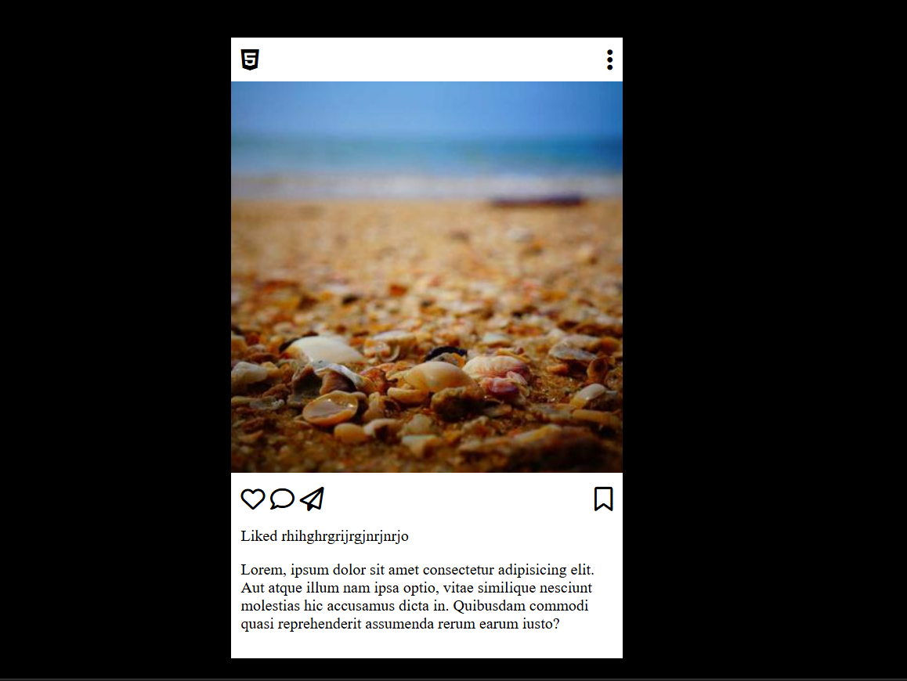

# Instagram Post Clone - HTML/CSS Practice

Este es un proyecto sencillo para practicar estructuras de diseño web (Layouts) utilizando **Flexbox** y la integración de fuentes externas e iconos.

## 🚀 Tecnologías Utilizadas
- **HTML5**: Estructura semántica.
- **CSS3**: Estilos y posicionamiento con Flexbox.
- **Google Fonts**: Fuente 'Roboto'.
- **FontAwesome**: Iconografía profesional.

## 🛠️ Conceptos Clave Aprendidos
- **Flexbox**: Uso de `justify-content: space-between` para cabeceras y `gap` para espaciado de iconos.
- **External Resources**: Importación de librerías mediante CDN (Content Delivery Network).
- **Box Model**: Gestión de `padding` y `margin` para el diseño de tarjetas (cards).

## 📸 Previsualización
> [!TIP]
> 

## 📦 Cómo ejecutar el proyecto
1. Clona este repositorio:
   `git clone https://github.com/MarioDR25/Post-de-Instagram-Mario.git`
2. Abre el archivo `index.html` en tu navegador.